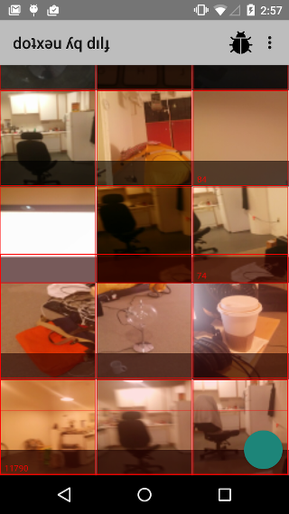
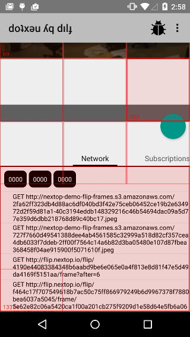
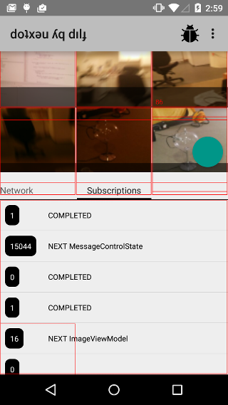

#  Binding Rx subscriptions to view lifecycles, and using them to optimize your network traffic


By Brien Colwell <<brien@nextop.io>>


I started using RxJava on a real-time messaging app I developed from 2013-2014. Immediately I was sold that
 Rx fit nicely into a MVC (or MVVM in my case) world, where Rx was the controller glue that transformed models into
  view models and triggered updates to the views. I also immediately liked that most of the one-off callbacks
  in the app could be replaced by a common, adaptable interface, which made the app more modular
  with less code. Observables and Observers just made sense.
  Data gets pushed into your controller module, which does some processing, and pushes it somewhere else.
  Eventually a view model gets pushed out and the last mile of hooking that to a view is a one-liner
  (in Java8. 4x more lines for normal Android:).

After using it for a while I started to think about subscriptions more. In an average app session of around 4 minutes [1],
  it's common for the app to create and destroy hundreds of views. The mechanics of how the views
  get created and destroyed depend on whether the view is in a RecycleView, fragment, or activity.
  Regardless, the last mile of getting data into the view usually looks like this:

```java
MyView view = ...;
Observable<MyViewModel> vmObs = ...;
vmObs.subscribe(Action1<MyViewModel>() {
  public void call(MyViewModel vm) {
    view.setViewModel(vm);
  }
});
```

When the view model is large and complex, and can't be reset on each update, I've had success with creating
a custom data structure that can be incrementally updated with an API that the view uses to render and/or
layout child components:

```java
MyViewDataStruct viewDs = ...;
MyView view = ...;
Observable<MyViewDataStructUpdate> vmUpdateObs = ...;
vmUpdateObs.subscribe(new Action1<MyViewDataStructUpdate>() {
  public void call(MyViewDataStructUpdate update) {
    viewDs.update(update);
  }
});
// the data struct exposes an observable that notifies when return values from the API might have changed
viewDs.getObservable().subscribe(new Action1<MyViewDataStruct>() {
  public void call(MyViewDataStruct ds) {
    view.updateDataStruct(ds);
  }
});
```

Notice anything wrong? Ok, yeah, I wasn't thinking about subscriptions because the subscriptions from all those
subscribes are just dangling. The observables for the view model/updates never close, because the view model
lives as long as it's needed. So it's up to me to close the subscription when I no longer need it. When is that?
When the view goes off the screen.

Android provides hooks to determine when a view comes on and off the screen: [View#onAttachedToWindow]() and
[View#onDetachedFromWindow](). If you look at the ListView source, you'll see this is what it uses to attach and
detach from the adapter [2], so updates are ignored when the view is off the screen (sweet!).

[io.nextop.rx.RxViewGroup]() packages these hooks into an Rx-friends API. All your observables that
 should be unsubscribed from when the view goes off the screen get "bound" to the RxViewGroup via [RxViewGroup#bind](),
 producing "bound observables" of the same type.
  Now your Rx code can subscribe to the bound observables, and the underlying subscription
   to the source observable will be unsubscribed when the view detaches from the window, and resubscribed
   when the view attaches to the window. The subscriptions on top of the bound observable are not touched,
    but if the view is garbage collected, they will be too, since the subscription outside the
    RxViewGroup is broken.

Visually, it looks like this.

```java
RxViewGroup R = ...;
Observable<T> A = ...;
Observable<T> B = R.bind(obs);
Observer<T> C = ...;
B.subscribe(C);
```

Attached to window:

```
A <-(subscribed to)- B <-(subscribed to)- C
                     ^-(hard ref)- R
```

Detached from window:

```
A .................. B <-(subscribed to)- C
                     ^-(hard ref)- R
```

Ok, cool, so now I don't have to worry about cleaning up my subscriptions when views get destroyed.
But binding Rx subscriptions to view lifecycles (and fragment and activity lifecyles, see [RxFragment]() and [RxActivity]())
has a couple powerful side effect:

- Only subscriptions that are attached to the screen are active from the view model manager or model manager.
  Background work can be prioritized to fill these subscription above all else.
- I can visually see where subscriptions are attached in the UI (with a [DebugOverlayView]())

That first side effect may seem obvious, but normal apps have a lot of opaque queues that are hard to reach into.
Sqlite, filesystem, network are three prominent ones.
Out of the box with the most popular libraries, these queues don't let you re-prioritize a pending operation because
re-priorization is hard to do generally and correctly. For example, if a subscription
 loads an image (GET), that could be safely re-prioritized or canceled, but if a subscription
 updates an API (POST) that couldn't without knowledge about the specific update.

Nextop is a project to rethink the Android HTTP stack to allow this kind of traffic re-prioritization,
to make faster apps.
By integrating the view and the network stack, it has knowledge to figure out:

- when an image load can be downgraded/upgraded or canceled
- loading all preview images before higher-res
- pre-loading parts of child view models and canceling them when they are too far away or prioritizing those when the UI is opened
  (e.g. tapping from a row in a feed to an item)
- never lose your updates (POST) but automatically cancel GETs that are no longer useful


[Flip]() is a fully working real-time Android app that shows how to build an app with MVVM and RxViewGroup.


## References

1. http://info.localytics.com/blog/time-in-app-increases-by-21-across-all-apps
2. list view source around onAttachedToWindow/onDettchedFromWindow usage







